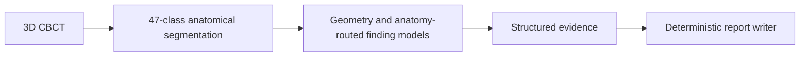

# REPGEN

**Anatomy-routed evidence-to-report generation for dental CBCT.**

[](https://odin2026.grand-challenge.org/)
[](https://www.python.org/)
[](LICENSE)
[](LICENSE_WEIGHTS)

This repository contains the inference implementation of the final **R248**
submission to **ODIN2026 Task 1: ToothFairy4**. One CBCT volume is converted
into structured anatomical evidence and an English diagnostic report.

**[Download weights](https://github.com/skk5215/REPGEN-ODIN2026/releases/tag/v1.0.0)**
&nbsp; | &nbsp; [Challenge](https://odin2026.grand-challenge.org/)
&nbsp; | &nbsp; [Third-party attribution](THIRD_PARTY.md)

## Pipeline



The segmenter identifies teeth, jawbones, canals, sinuses and prosthetic
structures. Geometry and ROI models add findings at tooth, arch or case level.
The final writer applies the submitted rules and phrasing. No LLM or VLM is
used during report generation.

## Quick start

### 1. Get the inference weights

```bash
git clone https://github.com/skk5215/REPGEN-ODIN2026.git
cd REPGEN-ODIN2026
python get_weights.py --output weights
```

The download is checksum-verified. It contains the required FP32 tensors,
buffers, model configuration and calibration constants, without optimizer
states or training histories.

### 2. Build the container

```bash
docker build --platform linux/amd64 -t repgen:1.0.0 .
```

Building requires internet access and enough disk space for the CUDA build
environment. The image compiles or installs the Mamba dependencies; this can
take longer than installing a pure-Python package. Linux with an NVIDIA GPU
and NVIDIA Container Toolkit is required for GPU inference.

### 3. Run one local scan

```bash
python run_case.py /path/to/scan.mha --weights weights --output output --gpu 0
```

The helper creates the challenge input structure and runs the container with
network access disabled. The CBCT stays local. Output is written to
`output/diagnostic-imaging-report.json` with the interface:

```json
{"report": "<generated report text>"}
```

## Runtime

| Item | Configuration |
| --- | --- |
| Input | One 3D CBCT in `.mha` format |
| Canonical spacing | 0.3 mm isotropic |
| Output | English report in a JSON object |
| Platform | `linux/amd64`, non-root |
| Target GPU | NVIDIA T4 16 GB; A10G 24 GB also supported |
| System memory | 32 GB |
| Neural parameters | Approximately 155.48M across active models |

The original R248 package was validated using a forced T4-compatible execution
path on an A100. A physical-T4 latency measurement is not claimed. This source
release repackages the inference weights and retains the submitted numerical
precision; its validation details are recorded in `release.json`.

<details>
<summary><strong>Model components</strong></summary>

- A 3D residual encoder-decoder with Mamba2 processing at the bottleneck.
- Endodontic and periodontal 3D ROI classifiers.
- A five-model impacted-tooth MIL ensemble with an independent crop guard.
- A five-model regional bone-atrophy ensemble.
- Twelve sinus ROI classifiers across folds and seeds.
- A coarse-to-fine CBCT lesion proposal branch.
- A learned tooth-occupancy model and fixed geometric relation rules.

There is one anatomical segmentation checkpoint. Ensemble members are kept
separately and all required parameters are included in the release asset.

</details>

## Scope

This is a public inference release. Training data, patient examples, clinical
reports, research logs and post-challenge experiments are not distributed.
The model was developed for a reporting benchmark and its output is a model
prediction, not an independently verified clinical assessment.

## Licensing and credit

Original repository code is distributed under **CC BY-NC 4.0**. The released
weights are distributed under **CC BY-NC-SA 4.0**. Third-party code retains its
original terms; the complete pipeline is for non-commercial use.

The anatomical backbone builds on the published
[U-Mamba2 implementation](https://github.com/zhiqin1998/U-Mamba2), pinned to
`2046d29785087b656ca69fa02dd40e43e69cfb42`, within
[nnU-Net](https://github.com/MIC-DKFZ/nnUNet). See [THIRD_PARTY.md](THIRD_PARTY.md).

External training sources were [ToothFairy3](https://ditto.ing.unimore.it/toothfairy3/)
and [DOLCHID](https://doi.org/10.6084/m9.figshare.30156622.v1), in addition to
the official challenge training data. Source data are obtained from their
providers and are not bundled here.
