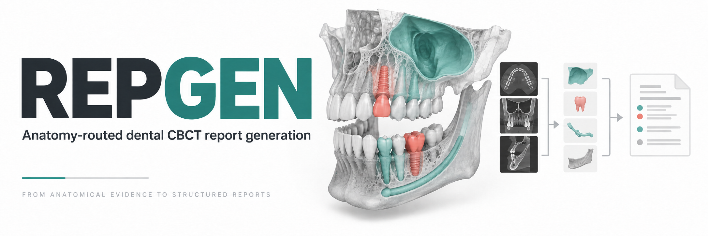
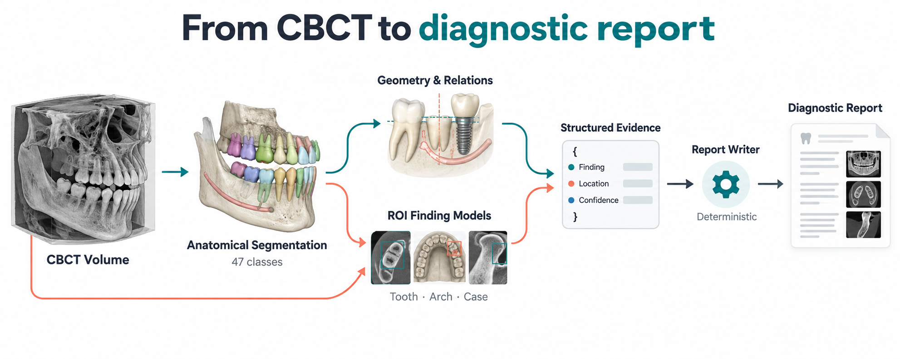

**3D CBCT to structured evidence to diagnostic report.**

[Weights](https://github.com/skk5215/REPGEN-ODIN2026/releases/tag/v1.0.0) |
[Challenge](https://odin2026.grand-challenge.org/) |
[Code licence](LICENSE) |
[Third-party credit](licenses/THIRD_PARTY.md)

REPGEN is the public inference implementation of our ODIN2026 Task 1 submission.
It combines anatomical segmentation, geometry-based relations and anatomy-routed
finding models to generate an English report. No LLM or VLM is used at inference.

## Pipeline



The segmenter routes image crops to the finding models and supports anatomical
relations. Both paths contribute structured evidence to a deterministic writer.
The illustrations above are synthetic explanatory graphics, not patient images
or measured model outputs. The submitted output is report text, not an illustrated
clinical document.

## Quick Start

```bash
git clone https://github.com/skk5215/REPGEN-ODIN2026.git
cd REPGEN-ODIN2026
python scripts/download_weights.py --output weights
docker build --platform linux/amd64 -t repgen:1.0.0 .
python scripts/run_case.py /path/to/scan.mha --weights weights --output output --gpu 0
```

The weight download is checksum-verified. Building requires internet access,
sufficient CUDA build storage and a Linux NVIDIA environment. Inference runs with
network access disabled. The input scan stays local.

**Output:** `output/diagnostic-imaging-report.json`

```json
{"report": "<generated report text>"}
```

## Runtime

| Input | Output | GPU target | Platform |
| --- | --- | --- | --- |
| 3D CBCT `.mha` | English report JSON | T4 16 GB / A10G 24 GB | Linux amd64, non-root |

<details>
<summary><strong>Technical Details</strong></summary>

- Canonical spacing: 0.3 mm isotropic.
- Anatomical segmentation: 47 classes.
- Approximately 155.48M neural parameters across the active models.
- One segmentation checkpoint, anatomy-routed ROI classifiers, regional/MIL
  ensembles, a lesion proposal branch and learned tooth occupancy.
- Code: `src/repgen/`; contracts: `configs/`; utilities: `scripts/`.
- Parameters are distributed separately from the source repository.

The submitted runtime was validated on an A100 using the forced T4-compatible
path. Physical-T4 latency is not claimed. The repackaged CUDA container has not
been revalidated; details are recorded in `configs/release.json`.

</details>

## Licence and Research Use

Code: **CC BY-NC 4.0**. Weights: **CC BY-NC-SA 4.0**. Third-party code retains
its original terms. See `licenses/` for attribution and licence details.

The segmentation backbone uses the published
[U-Mamba2 implementation](https://github.com/zhiqin1998/U-Mamba2) within
[nnU-Net](https://github.com/MIC-DKFZ/nnUNet). External training sources include
[ToothFairy3](https://ditto.ing.unimore.it/toothfairy3/) and
[DOLCHID](https://doi.org/10.6084/m9.figshare.30156622.v1).

Training records, patient data and post-challenge experiments are not distributed.
Outputs are research predictions, not independently verified clinical diagnoses.
